<div align="center">

# 🛠️ TechCare - Professional Device Repair Platform

### _Connecting Customers with Expert Technicians_

[](https://github.com)
[](https://github.com)
[](LICENSE)
[](https://nodejs.org)
[](https://reactjs.org)
[](https://supabase.io)
[](https://stripe.com)

[🚀 Quick Start](#-quick-start) • [📐 Architecture](#-system-architecture) • [✨ Features](#-features) • [🔄 User Flows](#-user-flow-diagrams) • [📚 API Reference](#-api-endpoints) • [🤝 Contributing](#-contributing)

---

### 🌐 Live Demo

| Component | URL | Status |
|-----------|-----|--------|
| **🖥️ Frontend** | [techcareofficial.netlify.app](https://techcare-official-new.netlify.app/) |  |
| **⚙️ Backend API** | [techcare-flax.vercel.app](https://techcare-flax.vercel.app) |  |

---

</div>

## 📖 Overview

**TechCare** is a modern, enterprise-grade full-stack web application that revolutionizes the device repair industry in Sri Lanka. It connects customers with verified technicians through an intelligent matching system, featuring:

- 🤖 **AI-Powered Diagnostics** - Smart issue detection and cost estimation
- 🗺️ **Location-Based Services** - Find nearby technicians with Google Maps integration
- 💳 **Secure Payments** - Stripe-powered transaction processing
- ⚡ **Real-time Updates** - Live booking status and notifications
- 🏆 **Loyalty Program** - Reward points and tier-based benefits

---

## 📐 System Architecture

### High-Level Architecture Overview

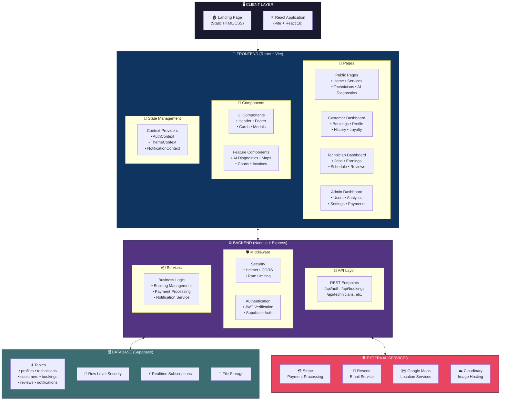

### Component Architecture

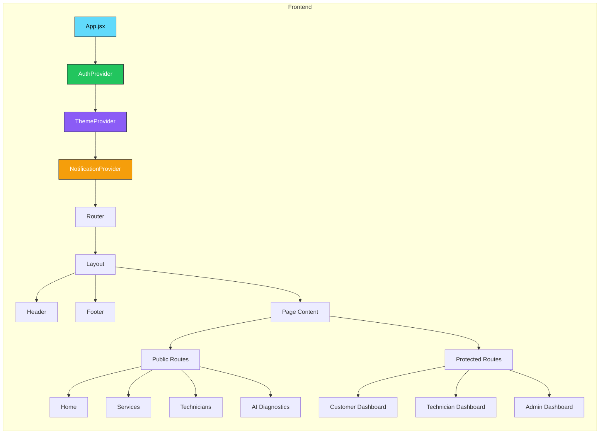

---

## 🗄️ Database Schema

### Entity Relationship Diagram

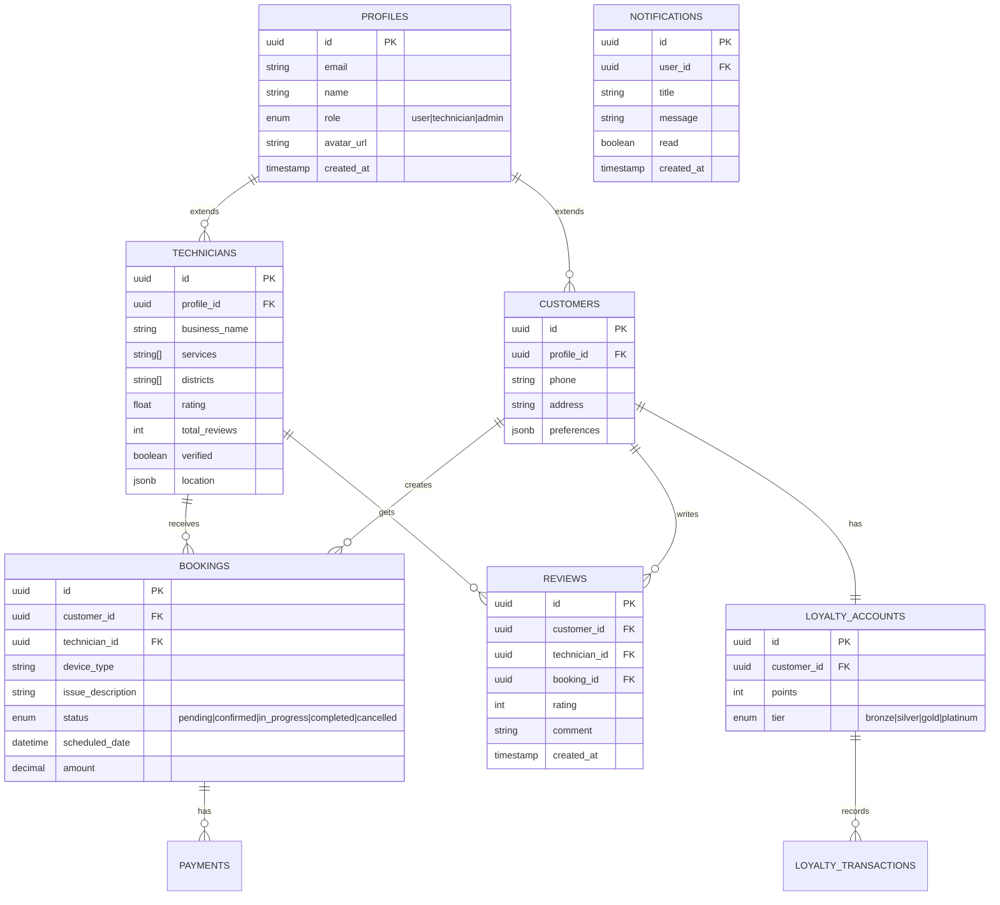

---

## 🔄 User Flow Diagrams

### 🔐 Authentication Flow

```mermaid
sequenceDiagram
    autonumber
    participant U as 👤 User
    participant F as 🖥️ Frontend
    participant A as 🔑 Auth API
    participant S as 🗄️ Supabase
    participant E as 📧 Email Service

    rect rgb(40, 40, 60)
        Note over U,E: Registration Flow
        U->>F: Fill registration form
        F->>A: POST /api/auth/register
        A->>S: Create user account
        S->>E: Send verification email
        E-->>U: Verification link
        U->>F: Click verification link
        F->>S: Verify email token
        S-->>F: Email confirmed
        F->>U: Redirect to login
    end

    rect rgb(60, 40, 40)
        Note over U,E: Login Flow
        U->>F: Enter credentials
        F->>A: POST /api/auth/login
        A->>S: Authenticate user
        S-->>A: User session + JWT
        A-->>F: Auth token + user data
        F->>F: Store in AuthContext
        F->>U: Redirect to dashboard
    end

    rect rgb(40, 60, 40)
        Note over U,E: Password Reset Flow
        U->>F: Click "Forgot Password"
        F->>A: POST /api/auth/forgot-password
        A->>S: Generate reset token
        S->>E: Send reset email
        E-->>U: Reset link
        U->>F: Enter new password
        F->>A: POST /api/auth/reset-password
        A->>S: Update password
        S-->>F: Password updated
        F->>U: Redirect to login
    end
```

### 📅 Booking Flow

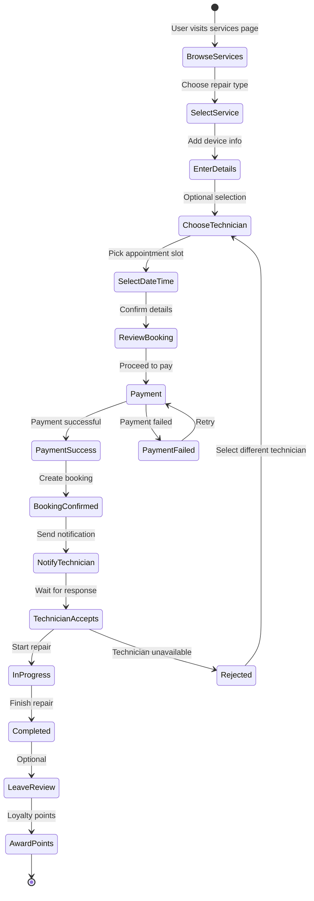

### 🤖 AI Diagnostics Flow

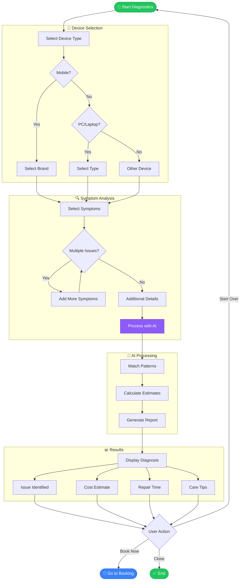

---

## 👥 User Roles & Permissions

### Role-Based Access Control

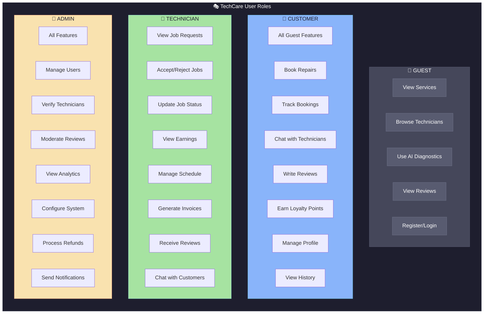

### Permission Matrix

| Feature | 👤 Guest | 🛒 Customer | 🔧 Technician | 👑 Admin |
|---------|:--------:|:-----------:|:-------------:|:--------:|
| **View Services** | ✅ | ✅ | ✅ | ✅ |
| **Browse Technicians** | ✅ | ✅ | ✅ | ✅ |
| **AI Diagnostics** | ✅ | ✅ | ✅ | ✅ |
| **Book Repairs** | ❌ | ✅ | ❌ | ✅ |
| **Customer Dashboard** | ❌ | ✅ | ❌ | ✅ |
| **Track Bookings** | ❌ | ✅ | ❌ | ✅ |
| **Write Reviews** | ❌ | ✅ | ❌ | ✅ |
| **Loyalty Points** | ❌ | ✅ | ❌ | ✅ |
| **Technician Dashboard** | ❌ | ❌ | ✅ | ✅ |
| **Accept Jobs** | ❌ | ❌ | ✅ | ❌ |
| **View Earnings** | ❌ | ❌ | ✅ | ✅ |
| **Generate Invoices** | ❌ | ❌ | ✅ | ✅ |
| **Admin Dashboard** | ❌ | ❌ | ❌ | ✅ |
| **Manage Users** | ❌ | ❌ | ❌ | ✅ |
| **System Settings** | ❌ | ❌ | ❌ | ✅ |

---

## 🔌 API Endpoints

### API Architecture

```mermaid
flowchart LR
    subgraph Client["Client"]
        WEB[Web App]
    end
    
    subgraph Gateway["API Gateway"]
        CORS[CORS]
        RATE[Rate Limiter]
        AUTH[Auth Middleware]
    end
    
    subgraph Routes["API Routes"]
        direction TB
        R1["/api/auth"]
        R2["/api/technicians"]
        R3["/api/bookings"]
        R4["/api/customers"]
        R5["/api/reviews"]
        R6["/api/loyalty"]
        R7["/api/payment"]
        R8["/api/notifications"]
        R9["/api/admin"]
        R10["/api/search"]
    end
    
    WEB --> CORS --> RATE --> AUTH --> Routes
    
    style Client fill:#61dafb,stroke:#282c34
    style Gateway fill:#f59e0b,stroke:#282c34
    style Routes fill:#22c55e,stroke:#282c34
```

### Endpoint Reference

| Endpoint | Method | Auth | Description |
|----------|--------|------|-------------|
| **Authentication** |
| `/api/auth/login` | POST | ❌ | User login |
| `/api/auth/register` | POST | ❌ | User registration |
| `/api/auth/logout` | POST | ✅ | User logout |
| `/api/auth/forgot-password` | POST | ❌ | Request password reset |
| `/api/auth/reset-password` | POST | ❌ | Reset password with token |
| **Technicians** |
| `/api/technicians` | GET | ❌ | List all technicians |
| `/api/technicians/:id` | GET | ❌ | Get technician details |
| `/api/technicians/nearby` | GET | ❌ | Find nearby technicians |
| `/api/technicians/search` | GET | ❌ | Search technicians |
| **Bookings** |
| `/api/bookings` | GET | ✅ | Get user's bookings |
| `/api/bookings` | POST | ✅ | Create new booking |
| `/api/bookings/:id` | GET | ✅ | Get booking details |
| `/api/bookings/:id` | PATCH | ✅ | Update booking status |
| `/api/bookings/:id/cancel` | POST | ✅ | Cancel booking |
| **Reviews** |
| `/api/reviews` | GET | ❌ | List reviews |
| `/api/reviews` | POST | ✅ | Create review |
| `/api/reviews/:id` | DELETE | ✅ | Delete review |
| **Loyalty** |
| `/api/loyalty/account` | GET | ✅ | Get loyalty account |
| `/api/loyalty/redeem` | POST | ✅ | Redeem reward |
| `/api/loyalty/history` | GET | ✅ | Get points history |
| **Payments** |
| `/api/payment/create-intent` | POST | ✅ | Create payment intent |
| `/api/payment/confirm` | POST | ✅ | Confirm payment |
| `/api/payment/refund` | POST | ✅ | Process refund |

---

## 🚀 Quick Start

### Prerequisites

- **Node.js** v20.x or higher
- **npm** v10.x or higher
- **Git** for version control

### ⚡ One-Click Start (Recommended)

```bash
# 1. Clone the repository
git clone https://github.com/Wenura17125/Tech-Care_official.git
cd Tech-Care_official

# 2. Verify your environment & install dependencies
.\scripts\verify-setup.bat

# 3. Launch the full stack application
.\scripts\start-techcare.bat
```

**That's it!** 🎉 The application will open automatically at `http://localhost:5173`

---

## 📦 Manual Installation

### Step-by-Step Setup

```bash
# 1. Clone Repository
git clone https://github.com/Wenura17125/Tech-Care_official.git
cd Tech-Care_official

# 2. Install Frontend Dependencies
npm install

# 3. Install Backend Dependencies
cd server
npm install
cd ..

# 4. Configure Environment Variables
# Create .env in root directory
# Create .env in server directory
```

### Environment Variables

**Root `.env`**
```env
VITE_API_URL=http://localhost:5000
VITE_GOOGLE_MAPS_API_KEY=your_google_maps_key
VITE_STRIPE_PUBLISHABLE_KEY=your_stripe_publishable_key
```

**Server `.env`**
```env
PORT=5000
SUPABASE_URL=your_supabase_url
SUPABASE_SERVICE_KEY=your_supabase_service_key
JWT_SECRET=your_jwt_secret
STRIPE_SECRET_KEY=your_stripe_secret_key
RESEND_API_KEY=your_resend_api_key
```

### Start Development Servers

```bash
# Terminal 1: Backend
cd server && npm run dev

# Terminal 2: Frontend
npm run dev
```

---

## 📂 Project Structure

```
Tech-Care_official/
├── 📁 docs/                      # Documentation
│   ├── PRD_ARCHITECTURE.md       # Technical specifications
│   └── ROLE_ACCESS_AND_VISIBILITY.md
├── 📁 scripts/                   # Automation scripts
│   ├── start-techcare.bat        # Full stack launcher
│   ├── verify-setup.bat          # Environment checker
│   └── verify-all.bat            # Deep verification
├── 📁 src/                       # Frontend source
│   ├── 📁 components/            # React components
│   │   ├── 📁 ui/                # Base UI components
│   │   ├── Header.jsx            # Navigation header
│   │   ├── Footer.jsx            # Site footer
│   │   ├── AIDiagnostics.jsx     # AI chat interface
│   │   ├── EarningsChart.jsx     # Earnings visualization
│   │   ├── InvoiceGenerator.jsx  # PDF invoice creation
│   │   └── LoyaltyPoints.jsx     # Rewards system
│   ├── 📁 pages/                 # Page components
│   │   ├── Home.jsx              # Landing page
│   │   ├── Services.jsx          # Service catalog
│   │   ├── Technicians.jsx       # Technician listing
│   │   ├── CustomerDashboard.jsx # Customer portal
│   │   ├── TechnicianDashboard.jsx # Tech portal
│   │   └── Admin.jsx             # Admin panel
│   ├── 📁 context/               # State management
│   │   ├── AuthContext.jsx       # Authentication
│   │   ├── ThemeContext.jsx      # Dark/light mode
│   │   └── NotificationContext.jsx
│   ├── 📁 lib/                   # Utilities
│   │   └── supabase.js           # Supabase client
│   ├── 📁 hooks/                 # Custom hooks
│   └── App.jsx                   # Root component
├── 📁 server/                    # Backend source
│   ├── 📁 routes/                # API endpoints
│   │   ├── auth.js               # Authentication
│   │   ├── technicians.js        # Technician APIs
│   │   ├── bookings.js           # Booking APIs
│   │   ├── payment.js            # Stripe integration
│   │   └── loyalty.js            # Loyalty system
│   ├── 📁 middleware/            # Express middleware
│   │   ├── security.js           # Security headers
│   │   └── supabaseAuth.js       # Auth middleware
│   ├── 📁 models/                # Data models
│   └── index.js                  # Server entry
├── 📁 public/                    # Static assets
│   └── 📁 landing/               # Marketing page
├── 📁 supabase/                  # Database migrations
├── package.json                  # Frontend deps
└── README.md                     # This file
```

---

## 🛠️ Tech Stack

### Technology Architecture

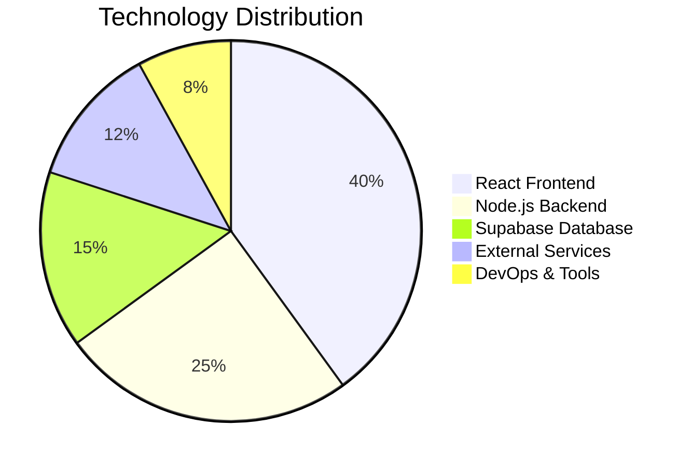

### Stack Details

| Layer | Technology | Purpose |
|-------|------------|---------|
| **Frontend** | React 18 + Vite | UI framework & build tool |
| | Tailwind CSS | Utility-first styling |
| | Radix UI | Accessible components |
| | React Router | Client-side routing |
| | Lucide React | Icon library |
| **Backend** | Node.js | Runtime environment |
| | Express.js | Web framework |
| | JWT | Token authentication |
| | Helmet | Security headers |
| **Database** | Supabase (PostgreSQL) | Primary database |
| | Row Level Security | Data protection |
| | Realtime | Live updates |
| **Services** | Stripe | Payment processing |
| | Resend | Email delivery |
| | Google Maps | Location services |
| | Cloudinary | Image hosting |
| **DevOps** | Netlify | Frontend hosting |
| | Vercel | Backend hosting |
| | GitHub | Version control |

---

## ✨ Features

### For Customers 🛒

| Feature | Description |
|---------|-------------|
| **🔍 Smart Search** | Find technicians by service, location, rating |
| **🗺️ Interactive Map** | Visualize nearby repair shops |
| **📅 Easy Booking** | Calendar-based appointment scheduling |
| **📱 Real-time Tracking** | Live status updates on repairs |
| **💬 In-app Chat** | Direct communication with technicians |
| **🤖 AI Diagnostics** | Get instant repair estimates |
| **🏆 Loyalty Rewards** | Earn points on every booking |
| **📜 Booking History** | Complete service records |

### For Technicians 🔧

| Feature | Description |
|---------|-------------|
| **📋 Job Board** | View and manage repair requests |
| **💰 Earnings Dashboard** | Track income and analytics |
| **📆 Schedule Manager** | Calendar with availability settings |
| **🧾 Invoice Generator** | Create professional invoices |
| **⭐ Review Management** | View and respond to reviews |
| **💬 Customer Chat** | Communicate with customers |
| **📊 Performance Stats** | Analytics and insights |

### For Admins 👑

| Feature | Description |
|---------|-------------|
| **👥 User Management** | Manage all platform users |
| **✅ Verification Queue** | Approve technician applications |
| **📊 Analytics Dashboard** | Platform-wide statistics |
| **🔔 Bulk Notifications** | Send announcements |
| **💳 Payment Oversight** | Monitor transactions |
| **⚙️ System Settings** | Configure platform options |

---

## 🎨 Design System

### Color Palette

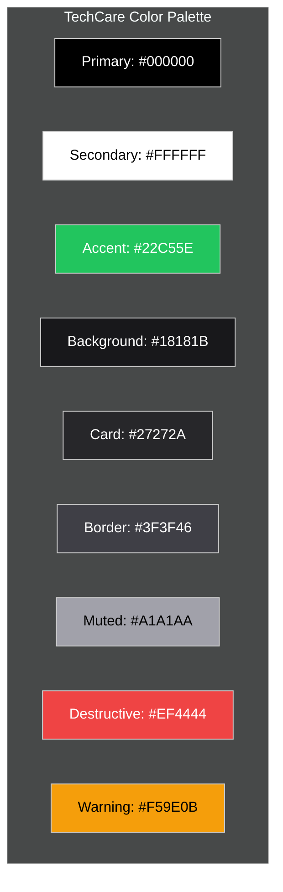

### Typography

- **Headings**: `font-bold tracking-tighter`
- **Body**: `font-medium`
- **Small**: `text-sm text-zinc-400`
- **Labels**: `uppercase tracking-widest`

---

## 📊 Performance Metrics

| Metric | Target | Current | Status |
|--------|--------|---------|--------|
| **Page Load (LCP)** | < 2.5s | ~1.8s | ✅ |
| **Login Time** | < 2s | ~1s | ✅ |
| **API Response (P95)** | < 500ms | ~200ms | ✅ |
| **First Input Delay** | < 100ms | ~50ms | ✅ |
| **Cumulative Layout Shift** | < 0.1 | ~0.05 | ✅ |
| **Bundle Size (gzipped)** | < 200KB | ~180KB | ✅ |

---

## 🧪 Testing

### Run Tests

```bash
# Verify environment setup
.\scripts\verify-setup.bat

# Run all verification checks
.\scripts\verify-all.bat

# Run API tests
node test-all-roles.js

# Run payment tests
node test-payment-api.js
```

---

## 📅 Development Roadmap

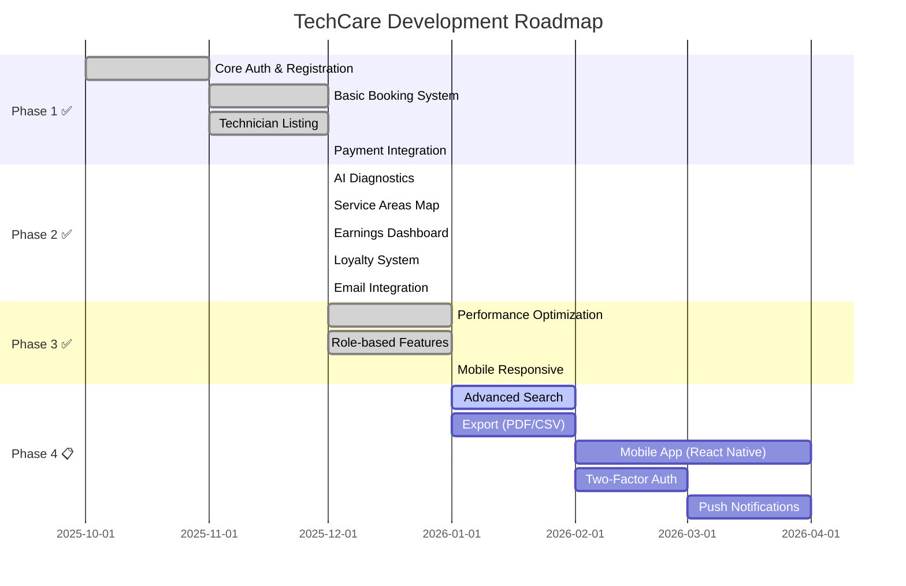

---

## 🔧 Sri Lanka Repair Shops Database

TechCare includes a curated database of **100+ top-rated repair shops** across Sri Lanka:

- **Data Source**: Google Maps verified listings
- **Coverage**: All major districts
- **Features**: Filter by district, service type, rating
- **Updates**: Regularly verified and updated

---

## 🤝 Contributing

> ⚠️ **IMPORTANT: Read Before Contributing**

This project is **solely owned by Wenura** ([@Wenura17125](https://github.com/Wenura17125)). All code, documentation, and features were developed exclusively by Wenura.

### 🔒 Protected Files (DO NOT MODIFY)

The following files are **strictly protected** and cannot be modified by contributors:

| File | Status | Reason |
|------|--------|--------|
| `README.md` | 🔒 **LOCKED** | Project identity and documentation |
| `LICENSE` | 🔒 **LOCKED** | Legal terms and ownership |
| `CONTRIBUTORS.md` | 🔒 **LOCKED** | Verified contributor list |
| `CODEOWNERS` | 🔒 **LOCKED** | Access control configuration |
| `/docs/*` | 🔒 **LOCKED** | Official documentation |
| `package.json` (name, author, license) | 🔒 **LOCKED** | Project identity fields |

**Any pull requests modifying these files will be automatically rejected.**

### ✅ Allowed Contributions

You may contribute to:
- Bug fixes in source code (`/src/`, `/server/`)
- New features (with prior discussion)
- Performance improvements
- Test coverage

### 📋 Contribution Terms

By submitting a contribution, you agree that:

1. ✅ All contributions become the **exclusive property of Wenura**
2. ✅ You waive all ownership claims to your contributions
3. ✅ Your contributions are original and don't infringe third-party rights
4. ✅ Contributions do NOT grant you project ownership
5. ❌ You may NOT modify protected files
6. ❌ You may NOT claim authorship of the project

### 🔄 How to Contribute

1. Fork the repository
2. Create a feature branch (`git checkout -b feature/your-feature`)
3. Make changes (to allowed files only)
4. Commit changes (`git commit -m 'Add feature'`)
5. Push to branch (`git push origin feature/your-feature`)
6. Open a Pull Request for review by @Wenura17125

---

## 📄 License

> ⚠️ **This is NOT an open-source project under MIT/GPL/Apache license.**

This project is licensed under the **TechCare Proprietary License**.

### Key Points:

| Permission | Status |
|------------|--------|
| ✅ View source code | Allowed |
| ✅ Fork for learning | Allowed |
| ✅ Personal use | Allowed |
| ❌ Commercial use | **Prohibited** without permission |
| ❌ Redistribution | **Prohibited** without permission |
| ❌ Claiming ownership | **Prohibited** |
| ❌ Modifying protected files | **Prohibited** |

See the [LICENSE](LICENSE) file for full terms and conditions.

**Copyright (c) 2025-2026 Wenura. All Rights Reserved.**

---

## 📞 Support

- **Documentation**: [docs/](./docs/)
- **Issues**: [GitHub Issues](https://github.com/Wenura17125/Tech-Care_official/issues)
- **Email**: support@techcare.com

---

<div align="center">

## ⭐ Show Your Support!

If you find TechCare helpful or interesting, please consider:

[](https://github.com/Wenura17125/Tech-Care_official)
[](https://github.com/Wenura17125)
[](https://github.com/Wenura17125/Tech-Care_official/pulls)

> 🌟 **Your star motivates me to keep improving this project!**
>
> 👥 **Follow for updates on new features and projects!**
>
> 🔧 **Contributions are always welcome - let's build together!**

---

### 🚀 Built with ❤️ by [Wenura](https://github.com/Wenura17125)

*A passionate full-stack developer from Sri Lanka, dedicated to building innovative solutions that make a difference.*

[](https://github.com/Wenura17125)
[](https://github.com/Wenura17125)

---

**Last Updated**: January 3, 2026 | **Version**: 2.0 | **Status**: ✅ Production Ready

[](https://reactjs.org)
[](https://supabase.io)
[](https://vercel.com)

---

*If you use this project or find it helpful, please give it a ⭐ - it helps others discover it too!*

</div>
