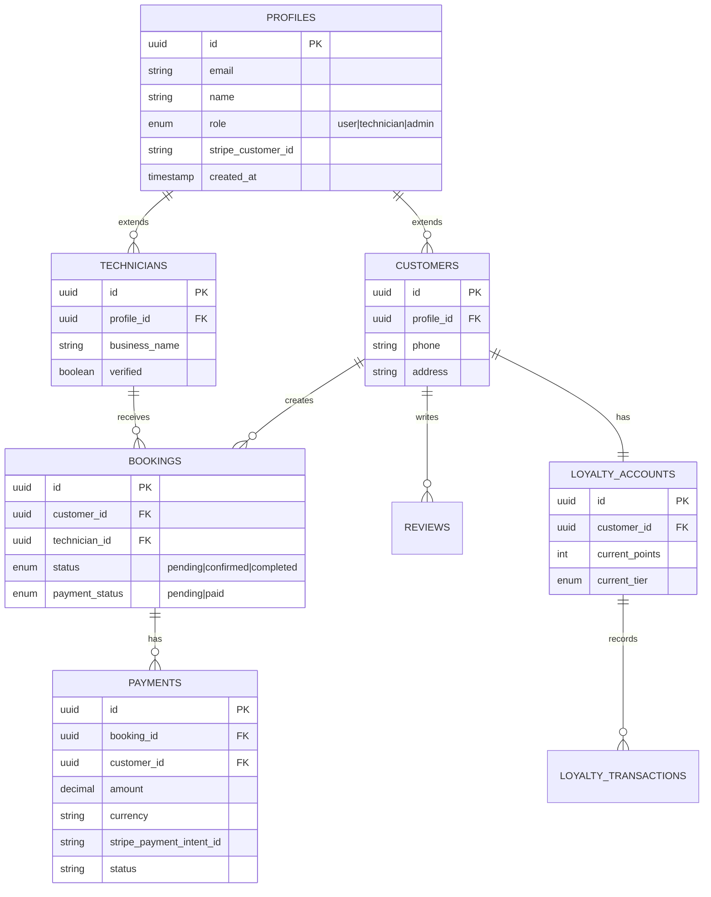
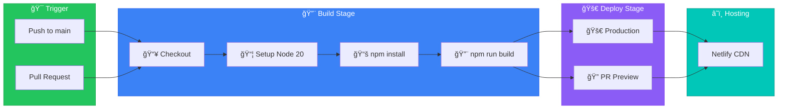

<div align="center">

# 🛠️ TechCare - Professional Device Repair Platform

### _Connecting Customers with Expert Technicians_

[](https://github.com)
[](https://github.com/Wenura17125/Tech-Care_official/commits/main)
[](https://github.com)
[](LICENSE)
[](https://github.com/Wenura17125/Tech-Care_official/actions)
[](https://nodejs.org)
[](https://reactjs.org)
[](https://supabase.io)
[](https://stripe.com)
[](https://techcare-official-new.netlify.app)

[🚀 Quick Start](#-quick-start) • [📐 Architecture](#-system-architecture) • [✨ Features](#-features) • [🔄 User Flows](#-user-flow-diagrams) • [📚 API Reference](#-api-endpoints) • [🤝 Contributing](#-contributing)

---

### 🌐 Live Demo

| Component | URL | Status | host |
|:----------|:----|:-------|:-----|
| **🖥️ Frontend** | [techcare-official-new.netlify.app](https://techcare-official-new.netlify.app/) |  | **Netlify** |
| **⚙️ Backend API** | [server-seven-ecru.vercel.app](https://server-seven-ecru.vercel.app) |  | **Vercel** |

### 🆕 Version History

<details open>
<summary><b>v2.2 - Payment & Infrastructure (Current)</b></summary>
<br>

*   ✅ **Stripe MCP**: Full multi-currency payment support with saved cards.
*   ✅ **Supabase Migration**: Complete transition from MongoDB to Supabase (PostgreSQL).
*   ✅ **Automated CI/CD**: GitHub Actions pipeline for auto-deploying to Vercel and Netlify.
*   ✅ **Admin Access**: Fixed role-based access control for backend booking APIs.
</details>

<details>
<summary><b>v2.1 - Stability Patch (Jan 2026)</b></summary>
<br>

*   ✅ **API Stability**: Fixed schema mismatches in Reviews API reducing server errors.
*   ✅ **UI/UX Polish**: Eliminated visual gaps on dark-themed pages (Careers, Partner, etc.).
*   ✅ **Error Handling**: Improved authentication flow robustness and reduced console noise.
*   ✅ **Deployment**: Verified production deployments on Vercel and Netlify.
</details>

<details>
<summary><b>v2.0 - Core Platform Overhaul (Dec 2025)</b></summary>
<br>

*   🚀 **Frontend Remake**: Migrated from simple HTML/JS to React 18 + Vite.
*   🎨 **New Design System**: Implemented dark-mode first UI with TailwindCSS & Radix UI.
*   🔐 **Enhanced Auth**: Integrated Supabase Auth for secure, session-based login.
*   📱 **Mobile Responsive**: Fully optimized layouts for all device sizes.
</details>

<details>
<summary><b>v1.5 - Backend Integration (Nov 2025)</b></summary>
<br>

*   ⚙️ **Node.js Server**: Introduced Express.js backend for dynamic data handling.
*   🗄️ **MongoDB Database**: Moved from local storage/JSON to MongoDB (Legacy).
*   🔌 **REST API**: Created initial endpoints for bookings and technicians.
*   🔒 **Basic Auth**: JWT-based authentication system.
</details>

<details>
<summary><b>v1.0 - Initial Static Release (Oct 2025)</b></summary>
<br>

*   🌐 **Static Website**: Launched landing page with Services and About/Contact sections.
*   🖼️ **UI Foundations**: Basic CSS styling and responsive grid layout.
*   📝 **Forms**: Simple HTML forms for contact and career inquiries.
*   🗺️ **Maps**: Basic Google Maps embed for store location.
</details>

<details>
<summary><b>v0.5 - Beta / MVP (Sept 2025)</b></summary>
<br>

*   🧪 **Prototype**: Proof-of-concept wireframes and basic navigation.
*   🚧 **Services List**: Static list of repair services.
*   👥 **Team**: Initial team page and project setup.
</details>

---

</div>

## 📖 Overview

**TechCare** is a modern, enterprise-grade full-stack web application that revolutionizes the device repair industry in Sri Lanka. It connects customers with verified technicians through an intelligent matching system, featuring:

- 🤖 **AI-Powered Diagnostics** - Smart issue detection and cost estimation
- 🗺️ **Location-Based Services** - Find nearby technicians with Google Maps integration
- 💳 **Secure Payments** - Stripe-powered transaction processing
- ⚡ **Real-time Updates** - Live booking status and notifications
- 🏆 **Loyalty Program** - Reward points and tier-based benefits

---

## 📐 System Architecture

### High-Level Architecture Overview

```mermaid
flowchart TB
    subgraph Client["🖥️ CLIENT LAYER"]
        direction TB
        LP["🏠 Landing Page<br/>(Static HTML/CSS)"]
        RA["⚛️ React Application<br/>(Vite + React 18)"]
    end

    subgraph Frontend["🎨 FRONTEND (React + Vite)"]
        direction TB
        subgraph Pages["📄 Pages"]
            PUB["Public Pages<br/>• Home • Services<br/>• Technicians • AI Diagnostics"]
            CUST["Customer Dashboard<br/>• Bookings • Profile<br/>• History • Loyalty"]
            TECH["Technician Dashboard<br/>• Jobs • Earnings<br/>• Schedule • Reviews"]
            ADM["Admin Dashboard<br/>• Users • Analytics<br/>• Settings • Payments"]
        end
        subgraph Components["🧩 Components"]
            UI["UI Components<br/>• Header • Footer<br/>• Cards • Modals"]
            FEAT["Feature Components<br/>• AI Diagnostics • Maps<br/>• Charts • Invoices"]
        end
        subgraph State["🔄 State Management"]
            CTX["Context Providers<br/>• AuthContext<br/>• ThemeContext<br/>• NotificationContext"]
        end
    end

    subgraph Backend["⚙️ BACKEND (Node.js + Express)"]
        direction TB
        subgraph API["🔌 API Layer"]
            REST["REST Endpoints<br/>/api/auth, /api/bookings<br/>/api/technicians, etc."]
        end
        subgraph MW["🛡️ Middleware"]
            SEC["Security<br/>• Helmet • CORS<br/>• Rate Limiting"]
            AUTH["Authentication<br/>• JWT Verification<br/>• Supabase Auth"]
        end
        subgraph Services["📦 Services"]
            BIZ["Business Logic<br/>• Booking Management<br/>• Payment Processing<br/>• Notification Service"]
        end
    end

    subgraph Database["🗄️ DATABASE (Supabase)"]
        direction TB
        TABLES["📊 Tables<br/>• profiles • technicians<br/>• customers • bookings<br/>• reviews • notifications"]
        RLS["🔐 Row Level Security"]
        REALTIME["⚡ Realtime Subscriptions"]
        STORAGE["📁 File Storage"]
    end

    subgraph External["🌐 EXTERNAL SERVICES"]
        direction TB
        STRIPE["💳 Stripe<br/>Payment Processing"]
        RESEND["📧 Resend<br/>Email Service"]
        GMAPS["🗺️ Google Maps<br/>Location Services"]
        CLOUD["☁️ Cloudinary<br/>Image Hosting"]
    end

    Client --> Frontend
    Frontend <--> Backend
    Backend <--> Database
    Backend <--> External

    style Client fill:#1a1a2e,stroke:#16213e,color:#fff
    style Frontend fill:#0f3460,stroke:#16213e,color:#fff
    style Backend fill:#533483,stroke:#16213e,color:#fff
    style Database fill:#3c6e71,stroke:#16213e,color:#fff
    style External fill:#e94560,stroke:#16213e,color:#fff
```



### Component Architecture


---

## 🗄️ Database Schema

### Entity Relationship Diagram



---

## 🔄 User Flow Diagrams

### 🔐 Authentication Flow


### 💳 Payment Flow (Stripe MCP)

```mermaid
sequenceDiagram
    autonumber
    participant U as 👤 Customer
    participant F as 🖥️ Frontend
    participant B as ⚙️ Backend API
    participant ST as 💳 Stripe
    participant DB as 🗄️ Database

    Note over U,DB: Payment for Booking
    U->>F: Click "Pay Now"
    F->>B: POST /create-payment-intent (amount, currency)
    B->>DB: Get/Create Stripe Customer ID
    B->>ST: Create PaymentIntent (with Customer ID)
    ST-->>B: client_secret
    B-->>F: client_secret received
    
    U->>F: Enter Card Details & Confirm
    F->>ST: confirmPayment(client_secret, card)
    ST-->>F: Payment Success/Failure
    
    par Async Webhook
        ST->>B: Webhook: payment_intent.succeeded
        B->>DB: Update Booking (PAID) & Create Payment Record
    and Client Completion
        F->>B: POST /confirm-payment (Verify & Record)
        B->>DB: Verify Payment Status
        B-->>F: Confirmation Success
        F->>U: Show Success Message
    end
```



### 📅 Booking Flow


### 🤖 AI Diagnostics Flow

```mermaid
flowchart TD
    START([🚀 Start Diagnostics]) --> SELECT_DEVICE
    
    subgraph Input["📱 Device Selection"]
        SELECT_DEVICE[Select Device Type] --> DEVICE_MOBILE{Mobile?}
        DEVICE_MOBILE -->|Yes| MOBILE_BRAND[Select Brand]
        DEVICE_MOBILE -->|No| DEVICE_PC{PC/Laptop?}
        DEVICE_PC -->|Yes| PC_TYPE[Select Type]
        DEVICE_PC -->|No| OTHER[Other Device]
    end
    
    MOBILE_BRAND --> SYMPTOMS
    PC_TYPE --> SYMPTOMS
    OTHER --> SYMPTOMS
    
    subgraph Analysis["🔍 Symptom Analysis"]
        SYMPTOMS[Select Symptoms] --> MULTI_SELECT{Multiple Issues?}
        MULTI_SELECT -->|Yes| ADD_MORE[Add More Symptoms]
        ADD_MORE --> MULTI_SELECT
        MULTI_SELECT -->|No| ADDITIONAL[Additional Details]
        ADDITIONAL --> AI_PROCESS
    end
    
    subgraph AI["🤖 AI Processing"]
        AI_PROCESS[Process with AI] --> MATCH[Match Patterns]
        MATCH --> CALCULATE[Calculate Estimates]
        CALCULATE --> GENERATE[Generate Report]
    end
    
    GENERATE --> RESULT
    
    subgraph Output["📊 Results"]
        RESULT[Display Diagnosis] --> SHOW_ISSUE[Issue Identified]
        RESULT --> SHOW_COST[Cost Estimate]
        RESULT --> SHOW_TIME[Repair Time]
        RESULT --> SHOW_TIPS[Care Tips]
    end
    
    SHOW_ISSUE --> ACTION
    SHOW_COST --> ACTION
    SHOW_TIME --> ACTION
    SHOW_TIPS --> ACTION
    
    ACTION{User Action} -->|Book Now| BOOKING([📅 Go to Booking])
    ACTION -->|Start Over| START
    ACTION -->|Close| END([✅ End])

    style START fill:#22c55e,stroke:#16a34a,color:#fff
    style END fill:#22c55e,stroke:#16a34a,color:#fff
    style BOOKING fill:#3b82f6,stroke:#2563eb,color:#fff
    style AI_PROCESS fill:#8b5cf6,stroke:#7c3aed,color:#fff
```



---

## 👥 User Roles & Permissions

### Role-Based Access Control

```mermaid
flowchart TB
    subgraph Roles["🎭 TechCare User Roles"]
        direction TB
        
        subgraph GuestRole["👤 GUEST"]
            G1["View Services"]
            G2["Browse Technicians"]
            G3["Use AI Diagnostics"]
            G4["View Reviews"]
            G5["Register/Login"]
        end
        
        subgraph CustomerRole["🛒 CUSTOMER"]
            C1["All Guest Features"]
            C2["Book Repairs"]
            C3["Track Bookings"]
            C4["Chat with Technicians"]
            C5["Write Reviews"]
            C6["Earn Loyalty Points"]
            C7["Manage Profile"]
            C8["View History"]
        end
        
        subgraph TechnicianRole["🔧 TECHNICIAN"]
            T1["View Job Requests"]
            T2["Accept/Reject Jobs"]
            T3["Update Job Status"]
            T4["View Earnings"]
            T5["Manage Schedule"]
            T6["Generate Invoices"]
            T7["Receive Reviews"]
            T8["Chat with Customers"]
        end
        
        subgraph AdminRole["👑 ADMIN"]
            A1["All Features"]
            A2["Manage Users"]
            A3["Verify Technicians"]
            A4["Moderate Reviews"]
            A5["View Analytics"]
            A6["Configure System"]
            A7["Process Refunds"]
            A8["Send Notifications"]
        end
    end
    
    style Roles fill:#1e1e2e,stroke:#313244,color:#fff
    style GuestRole fill:#45475a,stroke:#585b70,color:#fff
    style CustomerRole fill:#89b4fa,stroke:#74c7ec,color:#1e1e2e
    style TechnicianRole fill:#a6e3a1,stroke:#94e2d5,color:#1e1e2e
    style AdminRole fill:#f9e2af,stroke:#fab387,color:#1e1e2e
    style G1 fill:#585b70,stroke:#6c7086,color:#fff
    style G2 fill:#585b70,stroke:#6c7086,color:#fff
    style G3 fill:#585b70,stroke:#6c7086,color:#fff
    style G4 fill:#585b70,stroke:#6c7086,color:#fff
    style G5 fill:#585b70,stroke:#6c7086,color:#fff
```



### Permission Matrix

| Feature | 👤 Guest | 🛒 Customer | 🔧 Technician | 👑 Admin |
|---------|:--------:|:-----------:|:-------------:|:--------:|
| **View Services** | ✅ | ✅ | ✅ | ✅ |
| **Browse Technicians** | ✅ | ✅ | ✅ | ✅ |
| **AI Diagnostics** | ✅ | ✅ | ✅ | ✅ |
| **Book Repairs** | ❌ | ✅ | ❌ | ✅ |
| **Customer Dashboard** | ❌ | ✅ | ❌ | ✅ |
| **Track Bookings** | ❌ | ✅ | ❌ | ✅ |
| **Write Reviews** | ❌ | ✅ | ❌ | ✅ |
| **Loyalty Points** | ❌ | ✅ | ❌ | ✅ |
| **Technician Dashboard** | ❌ | ❌ | ✅ | ✅ |
| **Accept Jobs** | ❌ | ❌ | ✅ | ❌ |
| **View Earnings** | ❌ | ❌ | ✅ | ✅ |
| **Generate Invoices** | ❌ | ❌ | ✅ | ✅ |
| **Admin Dashboard** | ❌ | ❌ | ❌ | ✅ |
| **Manage Users** | ❌ | ❌ | ❌ | ✅ |
| **System Settings** | ❌ | ❌ | ❌ | ✅ |

---

## 🔌 API Endpoints

### API Architecture


### Endpoint Reference

| Endpoint | Method | Auth | Description |
|----------|--------|------|-------------|
| **Authentication** |
| `/api/auth/login` | POST | ❌ | User login |
| `/api/auth/register` | POST | ❌ | User registration |
| `/api/auth/logout` | POST | ✅ | User logout |
| `/api/auth/forgot-password` | POST | ❌ | Request password reset |
| `/api/auth/reset-password` | POST | ❌ | Reset password with token |
| **Technicians** |
| `/api/technicians` | GET | ❌ | List all technicians |
| `/api/technicians/:id` | GET | ❌ | Get technician details |
| `/api/technicians/nearby` | GET | ❌ | Find nearby technicians |
| `/api/technicians/search` | GET | ❌ | Search technicians |
| **Bookings** |
| `/api/bookings` | GET | ✅ | Get user's bookings |
| `/api/bookings` | POST | ✅ | Create new booking |
| `/api/bookings/:id` | GET | ✅ | Get booking details |
| `/api/bookings/:id` | PATCH | ✅ | Update booking status |
| `/api/bookings/:id/cancel` | POST | ✅ | Cancel booking |
| **Reviews** |
| `/api/reviews` | GET | ❌ | List reviews |
| `/api/reviews` | POST | ✅ | Create review |
| `/api/reviews/:id` | DELETE | ✅ | Delete review |
| **Loyalty** |
| `/api/loyalty/account` | GET | ✅ | Get loyalty account |
| `/api/loyalty/redeem` | POST | ✅ | Redeem reward |
| `/api/loyalty/history` | GET | ✅ | Get points history |
| **Payments** |
| `/api/payment/create-intent` | POST | ✅ | Create payment intent |
| `/api/payment/confirm` | POST | ✅ | Confirm payment |
| `/api/payment/refund` | POST | ✅ | Process refund |

---

## 🚀 Quick Start

### Prerequisites

- **Node.js** v20.x or higher
- **npm** v10.x or higher
- **Git** for version control
- **Supabase Account** for database & auth

### ⚡ One-Click Start (Recommended)

```bash
# 1. Clone the repository
git clone https://github.com/Wenura17125/Tech-Care_official.git
cd Tech-Care_official

# 2. Verify your environment & install dependencies
.\scripts\verify-setup.bat

# 3. Launch the full stack application
.\scripts\start-techcare.bat
```

**That's it!** 🎉 The application will open automatically at `http://localhost:5173`

---

## 📦 Manual Installation

### Step-by-Step Setup

```bash
# 1. Clone Repository
git clone https://github.com/Wenura17125/Tech-Care_official.git
cd Tech-Care_official

# 2. Install Frontend Dependencies
npm install

# 3. Install Backend Dependencies
cd server
npm install
cd ..

# 4. Configure Environment Variables
# Create .env in root directory
# Create .env in server directory
```

### Environment Variables

**Frontend (`.env`)**
```env
# API Configuration
VITE_API_URL=http://localhost:5000

# Supabase (Required)
VITE_SUPABASE_URL=your_supabase_project_url
VITE_SUPABASE_ANON_KEY=your_supabase_anon_key

# Stripe (Payments)
VITE_STRIPE_PUBLISHABLE_KEY=your_stripe_publishable_key

# Google Maps
VITE_GOOGLE_MAPS_API_KEY=your_google_maps_key
```

**Backend (`server/.env`)**
```env
# Server
PORT=5000
NODE_ENV=development

# Supabase (Required)
VITE_SUPABASE_URL=your_supabase_project_url
SUPABASE_SERVICE_ROLE_KEY=your_super_secret_service_role_key

# Stripe (Payments)
STRIPE_SECRET_KEY=sk_test_...
STRIPE_WEBHOOK_SECRET=whsec_...

# Google Maps (Backend)
GOOGLE_MAPS_API_KEY=your_google_maps_api_key

# Email Service (Resend)
RESEND_API_KEY=re_...
```

### Start Development Servers

```bash
# Terminal 1: Backend
cd server && npm run dev

# Terminal 2: Frontend
npm run dev
```

---

## 📂 Project Structure

```
Tech-Care_official/
├── 📁 docs/                      # Documentation
│   ├── PRD_ARCHITECTURE.md       # Technical specifications
│   └── ROLE_ACCESS_AND_VISIBILITY.md
├── 📁 scripts/                   # Automation scripts
│   ├── start-techcare.bat        # Full stack launcher
│   ├── verify-setup.bat          # Environment checker
│   ├── verify-all.bat            # Deep verification
│   └── migrate.js                # Database migrations
├── 📁 src/                       # Frontend source
│   ├── 📁 components/            # React components
│   │   ├── 📁 ui/                # Base UI components
│   │   ├── Header.jsx            # Navigation header
│   │   ├── Footer.jsx            # Site footer
│   │   ├── AIDiagnostics.jsx     # AI chat interface
│   │   ├── EarningsChart.jsx     # Earnings visualization
│   │   ├── InvoiceGenerator.jsx  # PDF invoice creation
│   │   └── LoyaltyPoints.jsx     # Rewards system
│   ├── 📁 pages/                 # Page components
│   │   ├── Home.jsx              # Landing page
│   │   ├── Services.jsx          # Service catalog
│   │   ├── Technicians.jsx       # Technician listing
│   │   ├── CustomerDashboard.jsx # Customer portal
│   │   ├── TechnicianDashboard.jsx # Tech portal
│   │   └── Admin.jsx             # Admin panel
│   ├── 📁 context/               # State management
│   │   ├── AuthContext.jsx       # Authentication
│   │   ├── ThemeContext.jsx      # Dark/light mode
│   │   └── NotificationContext.jsx
│   ├── 📁 lib/                   # Utilities
│   │   └── supabase.js           # Supabase client
│   ├── 📁 hooks/                 # Custom hooks
│   └── App.jsx                   # Root component
├── 📁 server/                    # Backend source
│   ├── 📁 routes/                # API endpoints
│   │   ├── auth.js               # Authentication
│   │   ├── technicians.js        # Technician APIs
│   │   ├── bookings.js           # Booking APIs
│   │   ├── payment.js            # Stripe integration
│   │   └── loyalty.js            # Loyalty system
│   ├── 📁 middleware/            # Express middleware
│   │   ├── security.js           # Security headers
│   │   └── supabaseAuth.js       # Auth middleware
│   ├── 📁 models/                # Data models
│   └── index.js                  # Server entry
├── 📁 public/                    # Static assets
│   └── 📁 landing/               # Marketing page
├── 📁 supabase/                  # Database migrations
├── package.json                  # Frontend deps
└── README.md                     # This file
```

---

## 🛠️ Tech Stack

### Technology Architecture


### Stack Details

| Layer | Technology | Purpose |
|-------|------------|---------|
| **Frontend** | React 18 + Vite | UI framework & build tool |
| | Tailwind CSS | Utility-first styling |
| | Radix UI | Accessible components |
| | React Router | Client-side routing |
| | Lucide React | Icon library |
| **Backend** | Node.js | Runtime environment |
| | Express.js | Web framework |
| | Stripe SDK | Payment processing |
| | Helmet | Security headers |
| **Database** | Supabase (PostgreSQL) | Primary database |
| | Row Level Security | Data protection & Auth |
| | Realtime | Live updates |
| **Services** | Stripe | Payment processing (MCP) |
| | Resend | Email delivery |
| | Google Maps | Location services |
| | Cloudinary | Image hosting |
| **DevOps** | Netlify | Frontend hosting |
| | Vercel | Backend hosting |
| | GitHub Actions | CI/CD Pipeline |

---

## ✨ Features

### For Customers 🛒

| Feature | Description |
|---------|-------------|
| **🔍 Smart Search** | Find technicians by service, location, rating |
| **🗺️ Interactive Map** | Visualize nearby repair shops |
| **📅 Easy Booking** | Calendar-based appointment scheduling |
| **📱 Real-time Tracking** | Live status updates on repairs |
| **💬 In-app Chat** | Direct communication with technicians |
| **🤖 AI Diagnostics** | Get instant repair estimates |
| **🏆 Loyalty Rewards** | Earn points on every booking |
| **📜 Booking History** | Complete service records |

### For Technicians 🔧

| Feature | Description |
|---------|-------------|
| **📋 Job Board** | View and manage repair requests |
| **💰 Earnings Dashboard** | Track income and analytics |
| **📆 Schedule Manager** | Calendar with availability settings |
| **🧾 Invoice Generator** | Create professional invoices |
| **⭐ Review Management** | View and respond to reviews |
| **💬 Customer Chat** | Communicate with customers |
| **📊 Performance Stats** | Analytics and insights |

### For Admins 👑

| Feature | Description |
|---------|-------------|
| **👥 User Management** | Manage all platform users |
| **✅ Verification Queue** | Approve technician applications |
| **📊 Analytics Dashboard** | Platform-wide statistics |
| **🔔 Bulk Notifications** | Send announcements |
| **💳 Payment Oversight** | Monitor transactions |
| **⚙️ System Settings** | Configure platform options |

---

## 🎨 Design System

### Color Palette


### Typography

- **Headings**: `font-bold tracking-tighter`
- **Body**: `font-medium`
- **Small**: `text-sm text-zinc-400`
- **Labels**: `uppercase tracking-widest`

---

## 📊 Performance Metrics

| Metric | Target | Current | Status |
|--------|--------|---------|--------|
| **Page Load (LCP)** | < 2.5s | ~1.8s | ✅ |
| **Login Time** | < 2s | ~1s | ✅ |
| **API Response (P95)** | < 500ms | ~200ms | ✅ |
| **First Input Delay** | < 100ms | ~50ms | ✅ |
| **Cumulative Layout Shift** | < 0.1 | ~0.05 | ✅ |
| **Bundle Size (gzipped)** | < 200KB | ~180KB | ✅ |

---

## 🔄 CI/CD Pipeline

TechCare uses **GitHub Actions** for continuous integration and automatic deployment to **Netlify**.

### Pipeline Architecture



### Deployment Workflow

| Event | Action | Environment |
|-------|--------|-------------|
| **Push to `main`** | Build → Deploy | 🚀 Production |
| **Pull Request** | Build → Preview | 🔍 Preview URL |
| **Manual Trigger** | Build → Deploy | 🚀 Production |

### Quick Deploy Commands

```bash
# Option 1: Auto-sync script (Windows)
scripts\auto-sync.bat

# Option 2: Manual git push
git add . && git commit -m "Your message" && git push origin main

# Option 3: Netlify CLI direct deploy
npm run build && netlify deploy --prod --dir=dist
```

### GitHub Secrets Required

| Secret | Purpose |
|--------|---------|
| `NETLIFY_AUTH_TOKEN` | Netlify deployment authentication |
| `NETLIFY_SITE_ID` | Target site identifier |
| `VITE_SUPABASE_URL` | Supabase project URL |
| `VITE_SUPABASE_ANON_KEY` | Supabase anonymous key |
| `VITE_API_URL` | Backend API endpoint |

---

## 🧪 Testing

### Run Tests

```bash
# Verify environment setup
.\scripts\verify-setup.bat

# Run all verification checks
.\scripts\verify-all.bat

# Run API tests
node test-all-roles.js

# Run payment tests
node test-payment-api.js
```

---

## 📅 Development Roadmap

```mermaid
gantt
    title TechCare Development Roadmap
    dateFormat  YYYY-MM
    section Phase 1 ✅
    Core Auth & Registration    :done, 2025-10, 2025-11
    Basic Booking System        :done, 2025-11, 2025-12
    Technician Listing          :done, 2025-11, 2025-12
    Payment Integration         :done, 2025-12, 2025-12
    
    section Phase 2 ✅
    AI Diagnostics              :done, 2025-12, 2025-12
    Service Areas Map           :done, 2025-12, 2025-12
    Earnings Dashboard          :done, 2025-12, 2025-12
    Loyalty System              :done, 2025-12, 2025-12
    Email Integration           :done, 2025-12, 2025-12
    
    section Phase 3 ✅
    Performance Optimization    :done, 2025-12, 2026-01
    Role-based Features         :done, 2025-12, 2026-01
    Mobile Responsive           :done, 2026-01, 2026-01
    
    section Phase 4 📋
    Advanced Search             :active, 2026-01, 2026-02
    Export (PDF/CSV)            :2026-01, 2026-02
    Mobile App (React Native)   :2026-02, 2026-04
    Two-Factor Auth             :2026-02, 2026-03
    Push Notifications          :2026-03, 2026-04
```



---

## 🔧 Sri Lanka Repair Shops Database

TechCare includes a curated database of **100+ top-rated repair shops** across Sri Lanka:

- **Data Source**: Google Maps verified listings
- **Coverage**: All major districts
- **Features**: Filter by district, service type, rating
- **Updates**: Regularly verified and updated

---

### 🤝 Contributing

This project was **built and is maintained by Wenura** ([@Wenura17125](https://github.com/Wenura17125)). We welcome contributions from the community to help make TechCare even better!

### ⚙️ Core Project Structure

To maintain consistency and security, the following files are considered core to the project identity:

| File | Status | Reason |
|------|--------|--------|
| `README.md` | ⚠️ **Review Required** | Project identity and documentation |
| `LICENSE` | 🔒 **LOCKED** | Legal terms and licensing |
| `CONTRIBUTORS.md` | ✨ **OPEN** | Add yourself here if you contribute! |
| `CODEOWNERS` | 🔒 **LOCKED** | Access control configuration |
| `/docs/*` | 📝 **Contributable** | Official documentation improvements welcome |
| `package.json` | 🛠️ **Source Only** | Identity fields should remain consistent |

**Pull requests modifying core identity fields in these files will require specific review.**

### ✅ Allowed Contributions

We love contributions! You can help with:
- Bug fixes in source code (`/src/`, `/server/`)
- New features (please open an issue first for discussion)
- Performance improvements
- Test coverage and documentation

### 📋 Contribution Terms

By submitting a contribution, you agree that:

1. ✅ Your contributions improve the platform for everyone
2. ✅ Your contributions are original and don't infringe third-party rights
3. ✅ You will follow the project's style and quality standards
4. ✅ Contributions are welcome from all developers globally
5. ❌ You may NOT claim sole authorship of the platform
6. ❌ You will respect the project's licensing and goal

### 🔄 How to Contribute

1. Fork the repository
2. Create a feature branch (`git checkout -b feature/your-feature`)
3. Make changes
4. Commit changes (`git commit -m 'Add feature'`)
5. Push to branch (`git push origin feature/your-feature`)
6. Open a Pull Request for review by the maintainers

---

## 📄 License

> ⚠️ **This is NOT an open-source project under MIT/GPL/Apache license.**

This project is licensed under the **TechCare Proprietary License**.

### Key Points:

| Permission | Status |
|------------|--------|
| ✅ View source code | Allowed |
| ✅ Fork for learning | Allowed |
| ✅ Personal use | Allowed |
| ✅ Contributing improvements | Allowed |
| ❌ Commercial use | **Prohibited** without permission |
| ❌ Redistribution | **Prohibited** without permission |
| ❌ Claiming sole authorship | **Prohibited** |

See the [LICENSE](LICENSE) file for full terms and conditions.

**Copyright (c) 2025-2026 Wenura. All Rights Reserved.**

---

## 📞 Support

- **Documentation**: [docs/](./docs/)
- **Issues**: [GitHub Issues](https://github.com/Wenura17125/Tech-Care_official/issues)
- **Email**: support@techcare.com

---

<div align="center">

## ⭐ Show Your Support!

If you find TechCare helpful or interesting, please consider:

[](https://github.com/Wenura17125/Tech-Care_official)
[](https://github.com/Wenura17125)
[](https://github.com/Wenura17125/Tech-Care_official/pulls)

> 🌟 **Your star motivates me to keep improving this project!**
>
> 👥 **Follow for updates on new features and projects!**
>
> 🔧 **Contributions are always welcome - let's build together!**

---

### 🚀 Built with ❤️ by [Wenura](https://github.com/Wenura17125)

*A passionate full-stack developer from Sri Lanka, dedicated to building innovative solutions that make a difference.*

[](https://github.com/Wenura17125)
[](https://github.com/Wenura17125)

---

**Last Updated**: January 15, 2026 | **Version**: 2.1 | **Status**: ✅ Production Ready | **CI/CD**: ✅ Auto-Deploy

[](https://reactjs.org)
[](https://supabase.io)
[](https://vercel.com)

---

*If you use this project or find it helpful, please give it a ⭐ - it helps others discover it too!*

</div>
